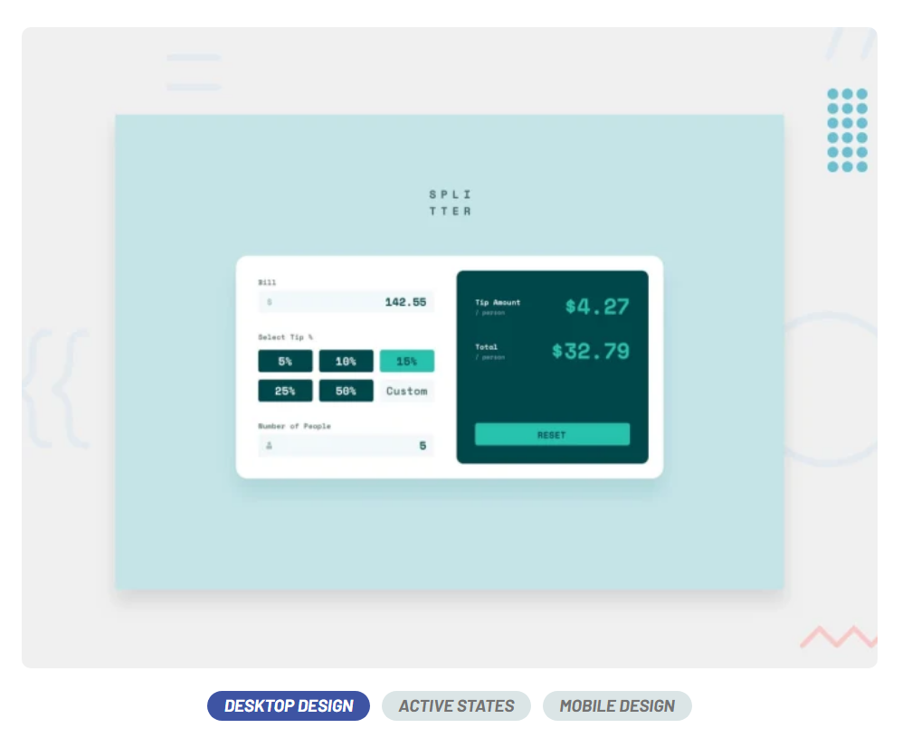
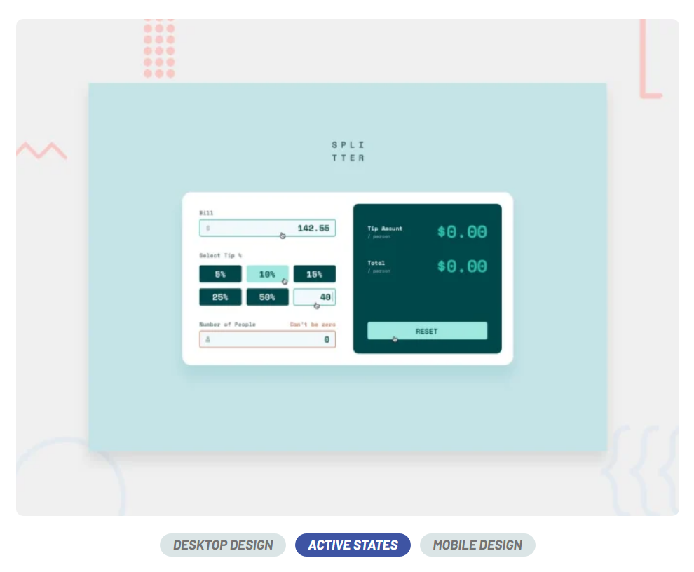
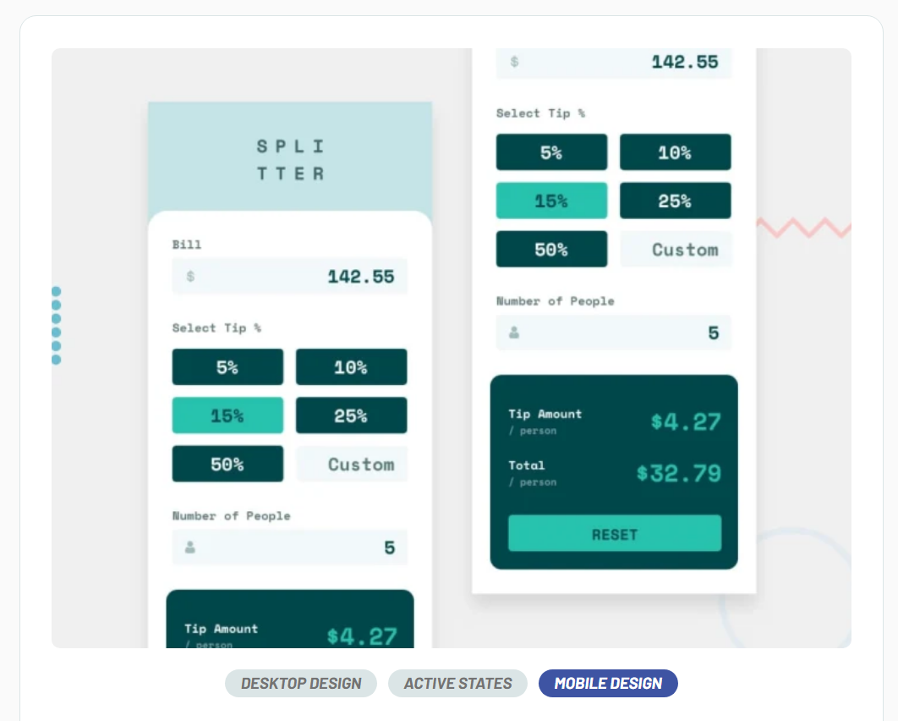

# Vue 3 + Vite 🚀
## Tip calculator app 💰

This small app is perfect for anyone starting to get to grips with JavaScript. The calculator functionality will be a nice test!

 🖥️
 💻
 📱

📝 Brief
Your challenge is to build out this tip calculator app and get it looking as close to the design as possible.

You can use any tools you like to help you complete the challenge. So if you've got something you'd like to practice, feel free to give it a go.

[code version](https://github.com/Yonerfy/Tip-calculator-app)👨🏾‍💻